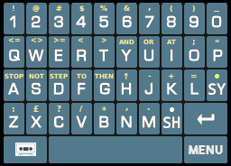

# SpeccySE


SpeccySE is a ZX Spectrum 48K / 128K Emulator for the DS/DSi

To run requires one or both of the original ZX Spectrum BIOS ROMs.
Place 48.ROM and 128.ROM (exactly so named) into the same directory 
as the emulator or else in /roms/bios or /data/bios

Features :
-----------------------
* Loads .SNA snapshots (48K only)
* Loads .Z80 snapshots (V1, V2 and V3 formats)
* Loads .TAP files up to 640K total length (can swap tapes mid-game)
* Loads .TZX files up to 640K total length (can swap tapes mid-game)
* Kempston and Sinclair joystick support.
* Fully configurable keys for the 12 NDS keys to any combination of joystick/keyboard
* Save and Restore states so you can pick up where you left off
* Chuckie-Egg style Joystick configuration to make climing ladders more forgiving (try it - you'll like it!)
* High Score saving for 10 scores with initials, date/time.
* Solid Z80 core that passes the ZEXDOC test suite (covering everything but not undocumented flags).
* Minimal design asthetic - pick game, play game. Runs unpached from your SD card via TWL++ or similar.

Copyright :
-----------------------
SpeccySE is Copyright (c) 2025 Dave Bernazzani (wavemotion-dave)

As long as there is no commercial use (i.e. no profit is made),
copying and distribution of this emulator, it's source code
and associated readme files, with or without modification, 
are permitted in any medium without royalty provided this 
copyright notice is used and wavemotion-dave (SpeccySE),
and Marat Fayzullin (Z80 core) are thanked profusely.

The sound driver (ay38910) are libraries from FluBBa (Fredrik Ahlström) 
and those copyrights remain his.

Royalty Free Music for the opening jingle provided by Anvish Parker

The SpeccySE emulator is offered as-is, without any warranty.

ZX SPECTRUM BIOS ROMS :
-----------------------
The emulator does not include any proprietary BIOS ROMs but you will
need them to play anything. There are two ZX Spectrum BIOS ROMs you 
will need - they must be exactly so named (rename as needed) and placed 
into the same directory as the emulator or else /ROMS/BIOS (that's where
the cool kids keep them):

```
* 48.ROM    with CRC32 of ddee531f
* 128.ROM   with CRC32 of 2cbe8995
```

Use of any other non-standard ZX Spectrum roms is likely to end in tears.

The ZX Keyboard :
-----------------------
The emulator has a built-in virtual touch keyboard that works reasonably well
except that the touch screen is not multi-touch (like your phone). So you 
can only press on one area of the screen at a time. To make the SYMBOL and
SHIFT keys work, when you press those buttons, you will see a little white
or yellow indicator at the top of the screen indicating that this button 
is a symbol/shift button and it will wait for the _next_ button to be pressed
and use it in combination with the symbol/shift. So if you want to type the 
quote mark ("), you would press and release Symbol, then press the letter P.



Joystick Support :
-----------------------
The emulator has support for the Kempston and Sinclair (67890) joysticks but
really any keyboard key can be mapped to any one of the 12 NDS buttons
so you should be able to configure things exactly as desired. When using
the 'REDEFINE KEYS' menu, you can press the NDS 'X' button to toggle between
a number of commonly used preset keys for various ZX games (QAOP, ZXM, etc).
By default, the configuration for any game is set to use the Kempston joystick.

Also be aware that there is a D-PAD option that can be set to 'CHUCKIE' for
games that are often unforgiving using a joystick. If you've ever played 
Chuckie Egg on a keybaord you know that it's pinpoint percise... but with 
a joystick, it can be a bit frustrating trying to find the exact spot to 
transition from Left/Right to Up/Down to climb a ladder. The 'CHUCKIE' mode
will hold the L/R or U/D for a fraction of a frame while the transition 
is made. This allows for buttery smooth (relatively speaking) transitions
on the ladders. It's likely other games will benefit from this mode - but
Chuckie Egg is the reason I put it into the emulator and so that's the
name it gets.


Tape Support :
-----------------------
The emulator supports .Z80 snapshots but of more use is the .TAP and
.TZX tape support. The .TAP format is fully supported and the .TZX is 
reasonably supported minus some of the more complicated blocks - most
software never uses those specialized blocks. As with any old tape-based
software, sometimes the .TAP or .TZX files are a bit dodgy - so if one
version of a tape doesn't work, go find another and it will probably
load up and play properly.

Speaking of loading - I decided not to optimize away the loading screens
but they are greatly accelerated. Most games load at 10-15x the original
speeds... meaning a 48K game should load in under 15 seconds and a full
128K game might take a half-minute or so... Enjoy the loading screens - they
were part of the charm of the original system.

You can press the Cassette Icon to swap in another tape or set the tape
position manually. Most games just figure it out - and the auto-play
and auto-stop of tapes should be working _reasonably_ well. You can 
override this as needed. While the tape is playing, most of the keyboard
handling is disabled to gain maximum speed - so if you find that the
auto tape stop isn't working, press the Cassette Icon and manually stop
the tape.

ROM Support :
-----------------------
The emulator allows you to load a .ROM file directly into the same memory
location as the BIOS (+0000 to +4000). Only up to 16K can be loaded in this
way. This is mainly used to load diagnostic test programs such as the
amazing RETROLEUM DIAGROM.

More to come...
