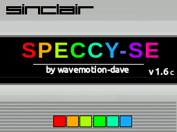

# SpeccyDS


SpeccyDS is a ZX Spectrum 48K / 128K Emulator for the DS/DSi

To run requires one or both of the original ZX Spectrum BIOS ROMs.
Place 48.ROM and 128.ROM (exactly so named) into the same directory 
as the emulator or else in /roms/bios or /data/bios

Copyright :
-----------------------
SpeccyDS is Copyright (c) 2025 Dave Bernazzani (wavemotion-dave)

As long as there is no commercial use (i.e. no profit is made),
copying and distribution of this emulator, it's source code
and associated readme files, with or without modification, 
are permitted in any medium without royalty provided this 
copyright notice is used and wavemotion-dave (SpeccyDS),
and Marat Fayzullin (Z80 core) are thanked profusely.

The sound driver (ay38910) are libraries from FluBBa (Fredrik Ahlström) 
and those copyrights remain his.

Royalty Free Music for the opening jingle provided by Anvish Parker

The SpeccyDS emulator is offered as-is, without any warranty.

ZX SPECTRUM BIOS ROMS :
-----------------------
The emulator does not include any proprietary BIOS ROMs but you will
need them to play anything. There are two ZX Spectrum BIOS ROMs you 
will need - they must be exactly so named (rename as needed) and placed 
into the same directory as the emulator or else /ROMS/BIOS (that's where
the cool kids keep them):

```
* 48.ROM    with CRC32 of ddee531f
* 128.ROM   with CRC32 of 2cbe8995
```

Use of any other non-standard ZX Spectrum roms is likely to end in tears.

The ZX Keyboard :
-----------------------
The emulator has a built-in virtual touch keyboard that works reasonably well
except that the touch screen is not multi-touch (like your phone). So you 
can only press on one area of the screen at a time. To make the SYMBOL and
SHIFT keys work, when you press those buttons, you will see a little white
or yellow indicator at the top of the screen indicating that this button 
a symbol/shift button and it will wait for the _next_ button to be pressed
and use it in combination with the symbol/shift. So if you want to type the 
quote mark ("), you would press and release Symbol, then press the letter P.


