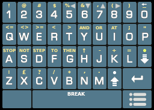

# SpeccySE


SpeccySE is a ZX Spectrum 48K / 128K Emulator for the DS/DSi

To run requires one or both of the original ZX Spectrum BIOS ROMs.
Place 48.ROM and 128.ROM (exactly so named) into the same directory 
as the emulator or else in /roms/bios or /data/bios

Features :
-----------------------
* Loads .TAP files up to 640K total length (can swap tapes mid-game)
* Loads .TZX files up to 640K total length (can swap tapes mid-game)
* Loads .Z80 snapshots (V1, V2 and V3 formats, 48K or 128K)
* Loads .SNA snapshots (48K only)
* Loads .Z81 files for ZX81 emulation (see below)
* Loads .ROM files up to 16K in place of standard BIOS (diagnostics, etc)
* Supports .POK files (same name as base game and stored in POK subdir)
* Kempston and Sinclair joystick support
* Fully configurable keys for the 12 NDS keys to any combination of joystick/keyboard
* Save and Restore states so you can pick up where you left off
* Chuckie-Egg style Joystick configuration to make climing ladders more forgiving (try it - you'll like it!)
* High Score saving for 10 scores with initials, date/time.
* Solid Z80 core that passes the ZEXDOC test suite (covering everything but not undocumented flags).
* Minimal design asthetic - pick game, play game. Runs unpached from your SD card via TWL++ or similar.

Copyright :
-----------------------
SpeccySE is Copyright (c) 2025 Dave Bernazzani (wavemotion-dave)

As long as there is no commercial use (i.e. no profit is made),
copying and distribution of this emulator, it's source code
and associated readme files, with or without modification, 
are permitted in any medium without royalty provided this 
copyright notice is used and wavemotion-dave (SpeccySE),
and Marat Fayzullin (Z80 core) are thanked profusely.

The sound driver (ay38910) are libraries from FluBBa (Fredrik Ahlström) 
and those copyrights remain his.

Royalty Free Music for the opening jingle provided by Anvish Parker

lzav compression (for save states) is Copyright (c) 2023-2025 Aleksey 
Vaneev and used by permission of the generous MIT license.

The Sinclair logo is used without permission but with the maximum
of respect and love.

The SpeccySE emulator is offered as-is, without any warranty.

Special Thanks :
-----------------------
Thanks to Flubba for the SN76496, AY38910 and SCC sound cores. You can seek out his latest and greatest at https://github.com/FluBBaOfWard

Also thanks to Marat Fayzullin, as the author of ColEM and Speccy - which is where the CZ80 CPU core came from.

And Sir Clive.

How do I run this thing? :
-----------------------
That's a bit beyond what I can help with in this readme... but if you have a DSi (with an SD card slot on the right-hand side of the handheld),
then you're in luck. Google 'DSi Camera Exploit' and 'Twilight Menu++' and you'll be on the right track. If you have an older DS handheld, you'll
probably have to use a flash/multi cart such as one of the R4 clones.

ZX Spectrum BIOS ROMS :
-----------------------
The emulator does not include any proprietary BIOS ROMs but you will
need them to play anything. There are two ZX Spectrum BIOS ROMs you 
will need - they must be exactly so named (rename as needed) and placed 
into the same directory as the emulator or else /ROMS/BIOS (that's where
the cool kids keep them):

```
* 48.ROM    with CRC32 of ddee531f
* 128.ROM   with CRC32 of 2cbe8995
```

Use of any other non-standard ZX Spectrum roms is likely to end in tears.

The ZX Keyboard :
-----------------------
The emulator has a built-in virtual touch keyboard that works reasonably well
except that the touch screen is not multi-touch (like your phone). So you 
can only press on one area of the screen at a time. To make the SYMBOL and
SHIFT keys work, when you press those buttons, you will see a little white
or yellow indicator at the top of the screen indicating that this button 
is a symbol/shift button and it will wait for the _next_ button to be pressed
and use it in combination with the symbol/shift. So if you want to type the 
quote mark ("), you would press and release Symbol, then press the letter P.



Emulator Use :
-----------------------
The emulator is fairly straightforward to navigatge. The main menu lets you 
select the game you wish to play (.TAP, .TZX or .Z80). Once you've picked
a game, the title will show at the bottom along with the size and CRC (which
isn't all that important but I like to see it). Then you can play the game or
you can change the settings for a game (define keys or set specific game 
options). Each game allows you to save off a configuration that is specific
to that game - so each game can have its own custom key settings, etc.

When you're playing the game, there are two button that bring up additional
menus. The cassette icon will bring up some options for dealing with the 
cassette (tape) player. Usually the tape will auto-start and auto-stop but
sometimes you have to override what's happening with the emulation. You can
also use this menu to swap in a 'Side B' or 'Tape 2' for the current game.

The other menu is the 'Mini Menu' which allows you to quit the current game, 
save/load the game state and set some high scores for the game being played.


Key Mapping :
-----------------------
Each game can have a custom set of keys mapped to the 12 DS/DSi keys (yes
that includes START, SELECT and the L/R shoulder buttons). By default, 
the DPad and 'A' button is set to the Kempston standard.


Joystick Support :
-----------------------
The emulator has support for the Kempston and Sinclair (67890) joysticks but
really any keyboard key can be mapped to any one of the 12 NDS buttons
so you should be able to configure things exactly as desired. When using
the 'REDEFINE KEYS' menu, you can press the NDS 'X' button to toggle between
a number of commonly used preset keys for various ZX games (QAOP, ZXM, etc).
By default, the configuration for any game is set to use the Kempston joystick.

Also be aware that there is a D-PAD option that can be set to 'CHUCKIE' for
games that are often unforgiving using a joystick. If you've ever played 
Chuckie Egg on a keybaord you know that it's pinpoint percise... but with 
a joystick, it can be a bit frustrating trying to find the exact spot to 
transition from Left/Right to Up/Down to climb a ladder. The 'CHUCKIE' mode
will hold the L/R or U/D for a fraction of a frame while the transition 
is made. This allows for buttery smooth (relatively speaking) transitions
on the ladders. It's likely other games will benefit from this mode - but
Chuckie Egg is the reason I put it into the emulator and so that's the
name it gets.

Game Options / Global Options :
-----------------------
There are a number of options you can tweak on a per-game basis as well
as a few global options that apply to the emulator in general. The most
useful of the global options is to select your starting directory. The
default is to start in /roms/speccy - you can have as many subdirectories
under that as you wish. The emulator can support a file listing of up 
to 2000 files with names no longer than 160 characters (so please keep
your filenames on the shorter side... although the emulator can scroll
the filename, there only about 30 characters can be shown on the screen
at a time).

One option that is of particular note is the ability to run the game
at a speed other than normal 100%. Some games were designed to run
a bit too fast to be enjoyable. Other games were a bit too slow. Using
this optional adjustment, you can run a game anywhere from 80% of full
speed (slower than normal) to 120% (faster than normal). The sound driver
should auto-adjust and while the music / sounds will sound faster/slower,
it should match the core emulation speed perfectly. This can be adjusted
on a per-game basis.

As for the per-game options, you can set things like the auto fire 
for the joystick and the aforementioned CHUCKIE mode of joystick d-pad
handling. One of the more useful per-game options is to decide how you
want to load the game - using a 48K Spectrum or the upgraded 128K Spectrum.
You can also force a load as 128K spectrum by pressing the NDS Y-Button
when loading. If you don't understand an option - don't touch it. You
have been duly warned!


Tape Support :
-----------------------
The emulator supports .Z80 snapshots but of more use is the .TAP and
.TZX tape support. The .TAP format is fully supported and the .TZX is 
reasonably supported minus some of the more complicated blocks - most
software never uses those specialized blocks. As with any old tape-based
software, sometimes the .TAP or .TZX files are a bit dodgy - so if one
version of a tape doesn't work, go find another and it will probably
load up and play properly.

Speaking of loading - I decided not to optimize away the loading screens
but they are greatly accelerated. Most games load at 10-15x the original
speeds... meaning a 48K game should load in under 15 seconds and a full
128K game might take a half-minute or so... Enjoy the loading screens - they
were part of the charm of the original system.

You can press the Cassette Icon to swap in another tape or set the tape
position manually. Most games just figure it out - and the auto-play
and auto-stop of tapes should be working _reasonably_ well. You can 
override this as needed. While the tape is playing, most of the keyboard
handling is disabled to gain maximum speed - so if you find that the
auto tape stop isn't working, press the Cassette Icon and manually stop
the tape.

Lastly - when you look for tape files on the internet, you will often 
find several tape images for the same game. Some tape dumps are dubious
and some tape dumps don't load properly with all emulators. Often times
an alternate "[a]" version will load. Usually one tape image dump is 
as good as any other - but keep searching and put yourself together a 
library of known good working images for Speccy-SE.

ROM Support :
-----------------------
The emulator allows you to load a .ROM file directly into the same memory
location as the BIOS (+0000 to +4000). Only up to 16K can be loaded in this
way. This is mainly used to load diagnostic test programs such as the
amazing RETROLEUM DIAGROM.

ZX81 Support :
-----------------------
The emulator supports the Paul Farrow ZX81 emulator for the ZX 128k machines.

http://www.fruitcake.plus.com/Sinclair/Interface2/Cartridges/Interface2_RC_New_ZX81.htm

To make this work, download the 16K Interface 2 ROM for the emulator - either Edition 2
or Edition 3 (do not use Edition 1 or the 'bugfix version').  Take this ROM file
and concatenate it with a ZX81 .p file for the game you want to play.

So let's say you want to play the original ZX81 Mazogs. Obtain the mazogs.p file and the 
aforementioned ZX81 emulator ROM and do the following:
```
Linux:   cat S128_ZX81_ED2_ROM.bin mazogs.p > mazogs.z81
Windows: copy /b S128_ZX81_ED2_ROM.bin + mazogs.p mazogs.z81
```

This will produce a .z81 file that is roughly 25K in size... it contains the emulator + the game .p file 
in one binary image. This .z81 file is now loadable directly into Speccy-SE - when you pick the game, it 
will automatically insert the keystrokes needed to get the emulator running. This takes about 10 seconds...
don't touch any virtual keys until the ZX81 game is fully loaded.

POK Support :
-----------------------
The emulator supports .pok files. The .pok file should have the same base
filename as the game you are playing and must be stored in a pok subdirectory.

So if you have a roms directory, make a pok subdirectory and place your .pok
file there. If properly named, you will see a list of all possible pokes when
you select the 'POKE MEMORY' menu option.

Memory Pokes remain in effect until you reset or reload the game. There is no 
other way to reverse the Memory Poke that has been done. If you are using a tape
(.TAP or .TZX) you should wait for the game to load before applying the memory
poke. Use at your own risk (oh... you can't really damage anything but the poke
might not work the way you expect if you do it at the wrong time).

Why? :
-----------------------
There was never a need for this emulator to exist. ZXDS is the defacto standard of 
accuracy and features for a ZX Spectrum emulator on the DS.  Why does this exist?
Mainly because as an American who got hooked on a Spectrum in recent months, I got
curious as to the workings. As a developer who had a number of DS/DSi emulators
under my belt, the best way for me to learn the ins-and-outs of the system was to
put together an emulator for the system. The design was kept very simple - and has
the benefit of running directly from SD card via TWL++ or Unlaunch or similar. But
really if you're looking for world-class ZX emulation for your DS/DSi handheld, 
you're likely going to want ZXDS.

Version History :
-----------------------
Version 1.0 - 14-Apr-2025 by wavemotion-dave
* First official release of Speccy-SE!

